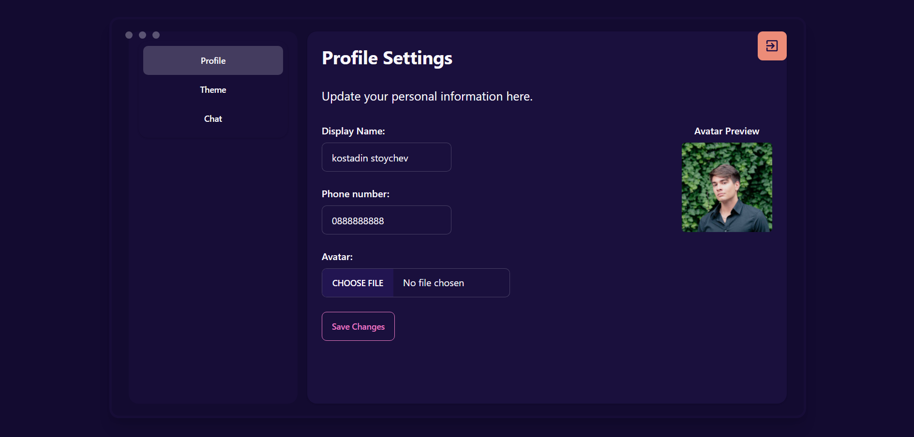
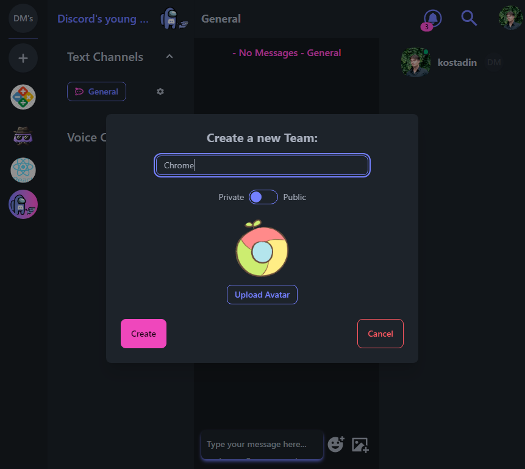
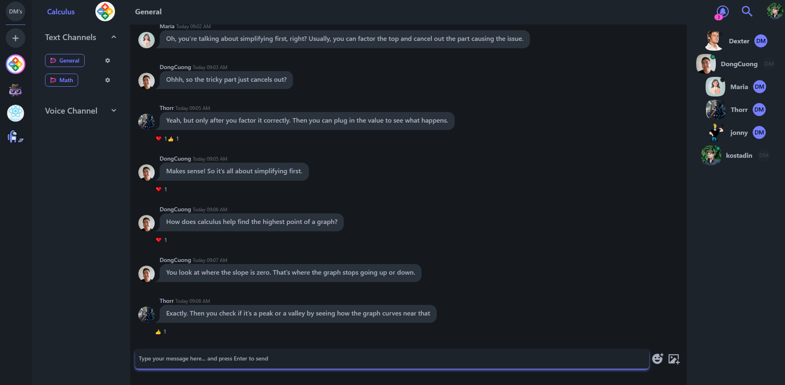
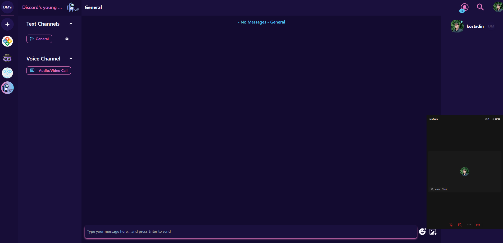
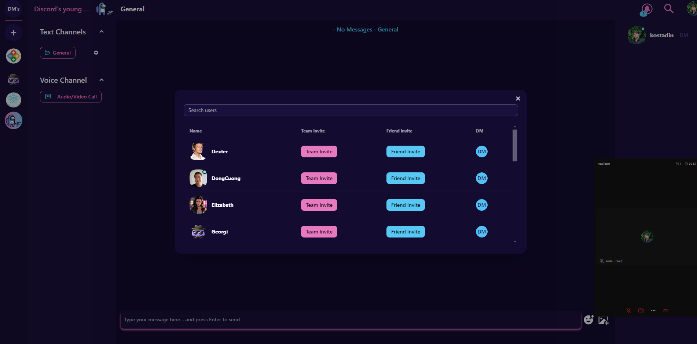
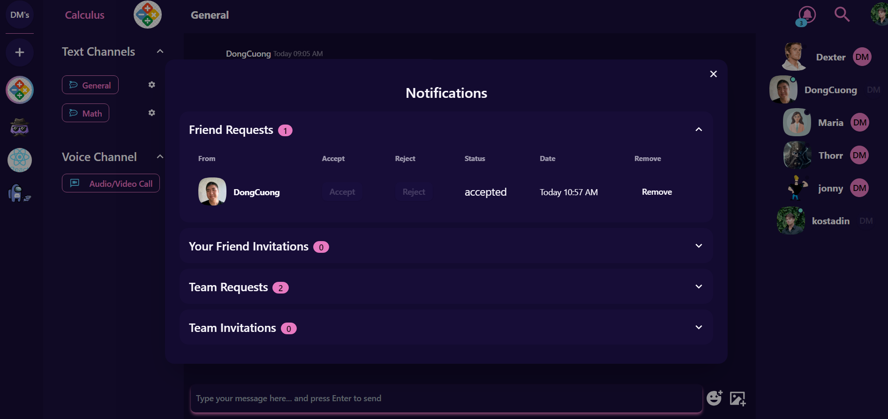
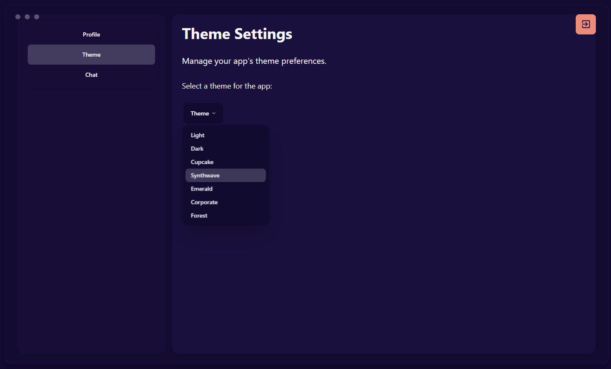

# Definitely Not Discord!

Definitely Not Discord is a web-based messaging application built with React, TypeScript, Firebase and Dyte. It allows users to create teams, send messages, and manage their profiles. Additionally, users can create meetings in teams with voice/video functionality.


## Features

- User authentication with Firebase
- Real-time messaging
- Team creation and management
- Profile settings
- Image uploads to Firebase Storage
- Create meetings video & voice calls

## Project Structure

src/
App.tsx
assets/
common/

    components/
        ChannelSideBar/
        CreateTeamButton/
        FriendInviteTable/
        ...
    config/

    helper/
    hoc/

    index.css
    main.tsx
    models/
    routes/
    services/

    store/
    Views/
        Settings/
            ProfileSettings/

    vite-env.d.ts

tailwind.config.js
tsconfig.app.json
tsconfig.json
tsconfig.node.json
vite.config.ts

## Getting Started

### Prerequisites

- Node.js
- npm or yarn
- Firebase account

## Setup Instructions

### 1. Clone the Repository

```bash
git clone https://github.com/your-username/final-project-messenger.git
cd final-project-messenger
```

### 2. Set up Firebase:

Create a Firebase project and enable Authentication, Realtime Database, and Storage.
Copy your Firebase configuration and add it to a .env file in the root directory:

```bash
   VITE_FIREBASE_API_KEY=your-api-key
   VITE_FIREBASE_AUTH_DOMAIN=your-auth-domain
   VITE_FIREBASE_DATABASE_URL=your-database-url
   VITE_FIREBASE_PROJECT_ID=your-project-id
   VITE_FIREBASE_STORAGE_BUCKET=your-storage-bucket
   VITE_FIREBASE_MESSAGING_SENDER_ID=your-messaging-sender-id
   VITE_FIREBASE_APP_ID=your-app-id
```

### Usage

## Profile Settings

Users can update their profile information, including display name, phone number, and avatar. The avatar image is uploaded to Firebase Storage.


## Team Management

Users can create teams and invite friends to join. Team avatars can also be uploaded to Firebase Storage.


## Messaging

Users can send messages in real-time within their teams.


## Team Meetings

Users can join meetings in teams and talk over video/audio in real-time with other team members.


## Search Users

Users can search for others by their username and send them friend and team invites or direct messages.


## Notifications

Users will get notifications for friend and team invitations and can also manage the requests they send.


## Theme Picker

Users can personalize their experience on the app by selecting their favorite theme from the settings menu.

